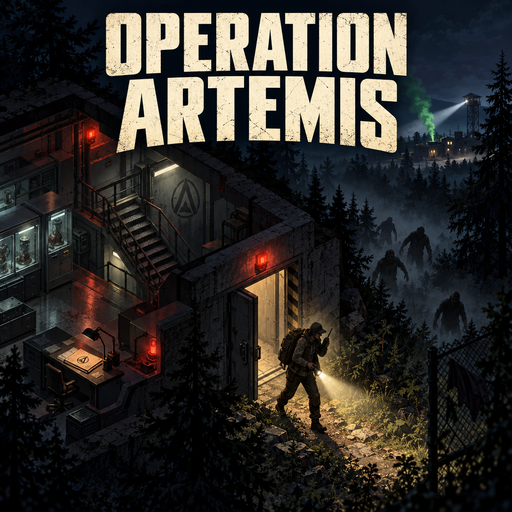

# Operation Artemis



**Survival was only the beginning.**

A story-driven end-game scenario for **Project Zomboid Build 42.21**. A notebook
taken from a military infected, a coded broadcast and someone called V lead you
across Knox County. Follow the evidence, uncover Operation Artemis and find a
way out of the Exclusion Zone.

> Work in progress. This repository contains the initial development snapshot,
> version 0.1.0, not a Steam Workshop release. The project does not yet have a
> Workshop ID.

## The investigation

- **Follow the signal.** Read the Artemis notebook and tune a military radio to
  the ARTEMIS broadcast. Documents, clues and a persistent journal guide the
  investigation inside your survival run.
- **Unravel the operation.** Explore a deserted bunker, a clinic, a radio relay
  and a secret underground base. Recover evidence, restore power and navigate
  security access before escaping the laboratory.
- **Get out alive.** Choose helicopter evacuation, the river and its ferryman,
  or the checkpoint. Each route has its own conditions, ending and epilogue.
  Additional river routes integrate with supported boat mods.

The scenario includes map reveals, alarms, staged encounters, a victory screen
and a chronicle of your run. An optional sterilization countdown adds a deadline
after the dossier is read.

Story text and voiced endings are available in **English and French**. Workshop
description translations are maintained separately in `README.steam*`.

## Requirements

| Requirement | Details |
|---|---|
| Game | Project Zomboid **42.21**, the development and recorded test target |
| Required mod | [Signal Smoke](https://steamcommunity.com/sharedfiles/filedetails/?id=3811010882), Mod ID `batman_SignalSmoke` |
| Optional mod | Belt Walkie-Talkie, Mod ID `batman_BeltRadio`: shared belt walkie-talkie behaviour; without it, the same behaviour is built in |
| Operation Artemis Mod ID | `batman_OperationArtemis` |
| Test harness | PZPuppeteer, only when running the documented test campaign |

Optional integrations are not required for the core helicopter, ferryman and
checkpoint routes. They need separate validation; see the coverage below and
the [project design notes](docs/conception-operation-artemis.md).

## Install from GitHub

1. Install Signal Smoke from the link above.
2. Clone this repository into your user Workshop development folder. On Windows,
   with the default user-data location:

   ```powershell
   git clone https://github.com/cyberbobjr/OperationArtemis.git "$env:USERPROFILE/Zomboid/Workshop/OperationArtemis"
   New-Item -ItemType Directory -Force -Path "$env:USERPROFILE/Zomboid/Workshop/OperationArtemis/Contents/mods/batman_OperationArtemis/common" | Out-Null
   ```

   The second command creates the empty `common` directory required by the
   Build 42 mod layout; Git does not track empty directories.

3. In the game's mod selector, enable **batman_Operation Artemis** and
   **Signal Smoke**. Restart the game completely before playing.
4. For a first run, create a new Sandbox game and leave **Enable Operation
   Artemis** switched on in its sandbox options.

The game loads the local project from `OperationArtemis/Contents/mods`.
Keep the repository structure intact. No copy into Steam's downloaded Workshop
content directory is needed.

## Start playing

Kill military infected, find the **Artemis notebook** and read it. Tune a
military radio to **108.0 MHz** by default, then follow the broadcast and the
clues. Starting the investigation does not require debug commands.

Under the default discovery settings, each military zombie killed has a **4%**
notebook drop chance, with a guaranteed drop by the **30th** qualifying kill.
The notebook can appear from the start of the game.

## Sandbox settings

The **Operation Artemis** sandbox page controls discovery, dramatic intensity,
screen effects and extraction timing.

| Setting | Default | Purpose |
|---|---|---|
| Notebook drop chance | 4% | Random discovery on military infected |
| Guaranteed notebook | 30 military kills | Upper limit before a guaranteed drop |
| Minimum discovery day | 0 | Makes discovery available from the start |
| New notebook delay | 7 days | Allows another notebook if the previous one was not read |
| Radio frequency | 108.0 MHz | ARTEMIS broadcast frequency |
| Dramatic intensity | Normal | Controls the intensity of key staged moments |
| Screen effects | Enabled | Fades and character thoughts |
| Landing zone hold | 30 in-game minutes | Helicopter extraction hold duration |
| Zone sterilization | Disabled (0 days) | Optional deadline after reading the dossier |
| Siege Night control | Suspend during the investigation | Optional control when Siege Night is active |
| Debug mode | Disabled | Development context menu |

For the complete definitions, see
[sandbox options](Contents/mods/batman_OperationArtemis/42.21/media/sandbox-options.txt).
Siege Night behavior is described in the
[integration notes](docs/siege-night-integration.md).

## Validation and known limits

The existing **Build 42.21 singleplayer campaign records** report successful
helicopter, ferryman and checkpoint endings, plus ending persistence after full
game restarts for helicopter and ferryman. These are recorded results from
development, not a claim that every branch has been tested.

- Some preparation used debug placement. Natural access through the secret
  base's exterior entrance remains outside that coverage.
- Multiplayer, boat routes and optional integrations still need dedicated
  in-game validation.
- A missed extraction, the full sterilization countdown and several alternate
  checkpoint branches remain unvalidated in game.

The campaign defines **31 scenarios**, with individual execution statuses in
the [results table](tests/puppeteer/RESULTATS.md). For reproduction, use the
[test instructions](tests/puppeteer/README.md) and
[campaign plans](tests/puppeteer/CAMPAGNES.md) on a dedicated test save.
Raw local reports and captures are excluded from Git; some evidence links in
the results table therefore refer to files that are not included in this repository.

## Repository layout

```text
Contents/mods/batman_OperationArtemis/
  common/                 Shared Build 42 mod directory
  42.21/                  Mod metadata, Lua, items, translations and media
docs/                     Design, integration and development test notes
tests/puppeteer/           In-game scenarios, campaign plans and collection tools
tests/lua/                Offline Lua tests (python tests/run_lua_tests.py, needs lupa)
source/                   Artwork, audio and promotional production sources
assets/                   Source assets and third-party resource credits
README.steam*             Steam Workshop descriptions and translations
workshop.txt              Workshop staging metadata
CHANGELOG.md              Development version history
CREDITS.md                Third-party resource attribution
```

See the [changelog](CHANGELOG.md) for the initial snapshot and its validation
limits. Design and test documents may reveal story details and endings.

## Credits and support

Ferry engine sound: **Work With Sounds / Werstas**,
[CC BY 4.0](https://creativecommons.org/licenses/by/4.0/), via
[Wikimedia Commons](https://commons.wikimedia.org/wiki/File:WWS_MSThtistart.ogg).
Edited for looping, mono playback and normalization. See
[resource credits](CREDITS.md) and [ferry audio credits](assets/ferry/CREDITS.md).

Enjoy the scenario? [Support the project on Ko-fi](https://ko-fi.com/batmanfr).
